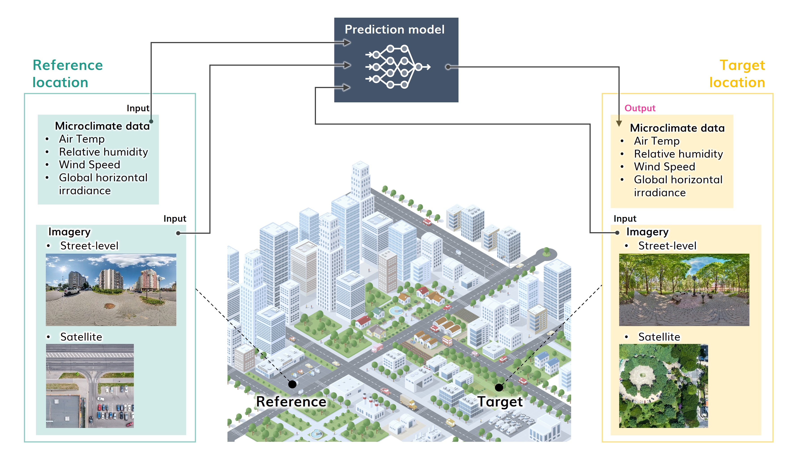
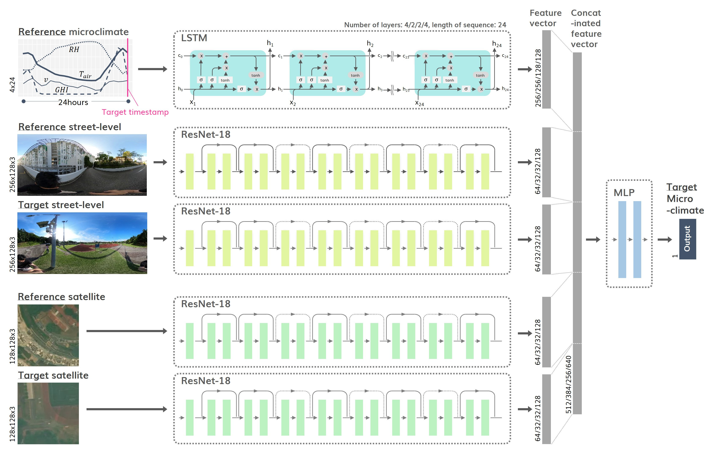
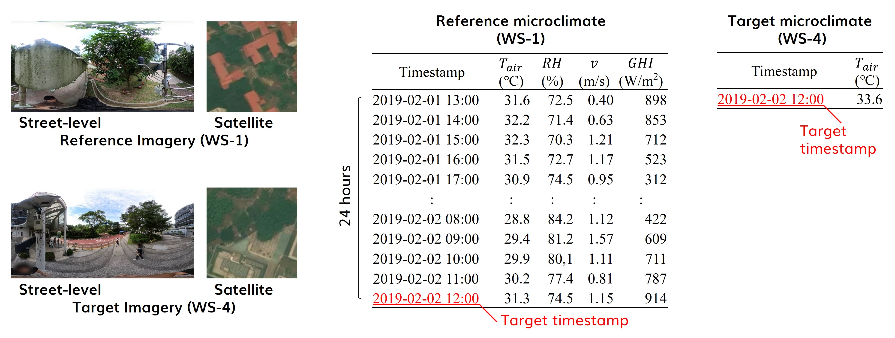

[](https://creativecommons.org/licenses/by-sa/4.0/)

# Overview




# Installation

Since `Microclimate Vision` uses `pytorch` and `torchvision`, you may need to install them separately. Please refer to the [official website](https://pytorch.org/get-started/locally/) for installation instructions.

# Usage

## Data preparation
Please refer to the sample files in the "data" directory. Note that these sample files do not contain observed real data, but rather virtual data created to demonstrate the proper data structure.



### Config file

## Training
```
python train.py --config path/to/config
```
## Test
```
python test.py --config path/to/config --model path/to/model --result path/to/result
```

# License

`Microclimate Vision` was created by Kunihiko Fujiwara. It is licensed under the terms of the CC BY-SA 4.0.

# Paper / Attribution / Citation

Please cite the [paper](https://doi.org/10.1016/j.scs.2024.105733) if you use `Microclimate Vision` in a scientific publication:

Fujiwara, K., Khomiakov, M., Yap, W., Ignatius, M., & Biljecki, F. (2024). Microclimate Vision: Multimodal prediction of climatic parameters using street-level and satellite imagery. Sustainable Cities and Society, 105733. doi:[10.1016/j.scs.2024.105733](https://doi.org/10.1016/j.scs.2024.105733)

```bibtex
@article{2024_scs_microclimate_vision,
 author = {Fujiwara, Kunihiko and Khomiakov, Maxim and Yap, Winston and Ignatius, Marcel and Biljecki, Filip},
 doi = {10.1016/j.scs.2024.105733},
 journal = {Sustainable Cities and Society},
 pages = {105733},
 title = {Microclimate Vision: Multimodal prediction of climatic parameters using street-level and satellite imagery},
 volume = {114},
 year = {2024}
}
```
